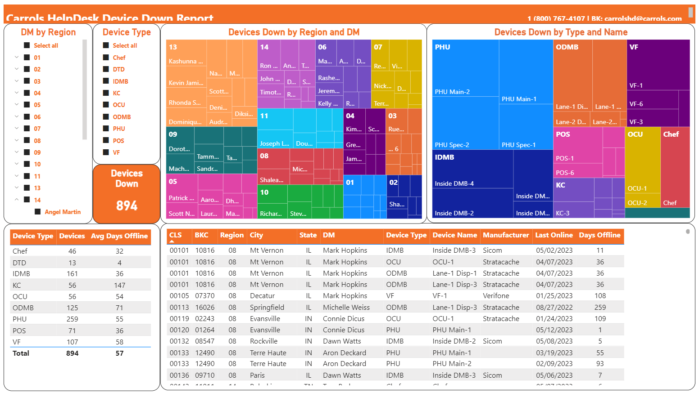
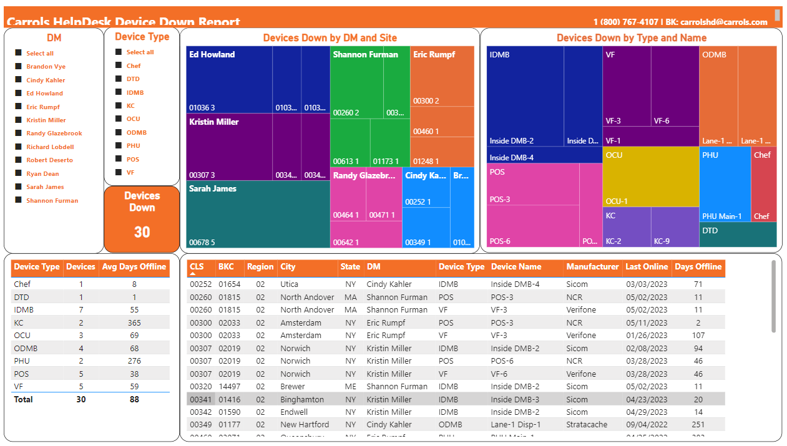
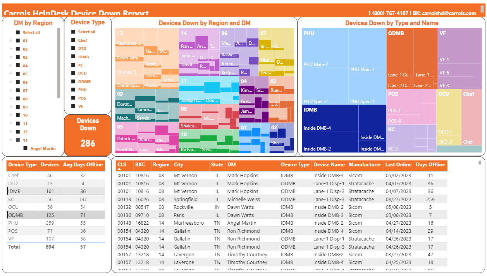
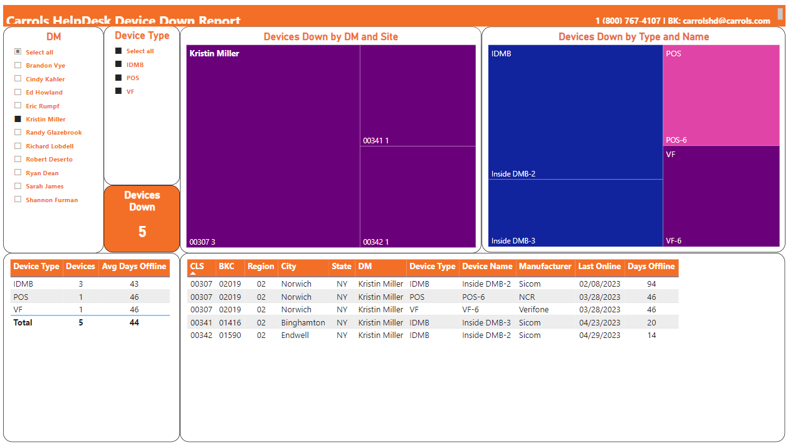
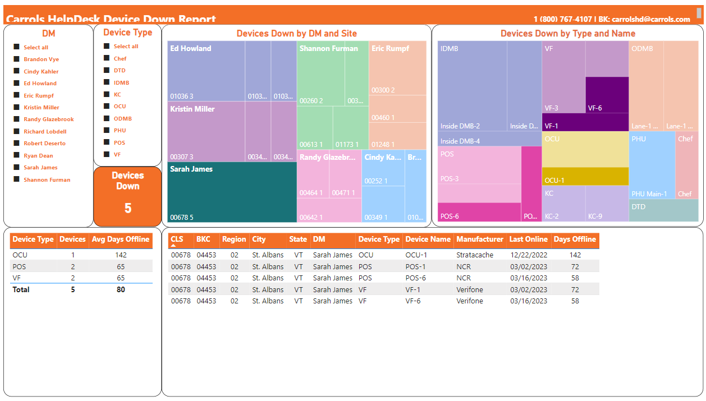
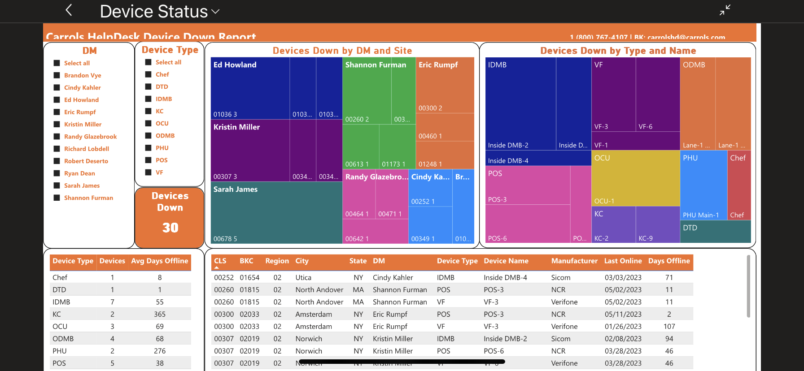

```{r setup, include=FALSE}
knitr::opts_chunk$set(echo = TRUE)
```

```{r library, warning=FALSE, message=FALSE}
library(tidyverse)
```

## PowerBI Visualization Project

I work for Carrols Corporation which is the largest Burger King franchisee in the US. In my role, I am responsible for managing the Windows computer systems and the other networked devices in each of our 1000 restaurants. 

I wanted to work with a dataset from my work and developed a data visualization using PowerBI with a dataset that I created for tracking the network status of each device in our restaurants. PowerBI is an enterprise tool, but I wanted to start learning it since it is the tool used in my organization. 

### Device Status Data

In each store there are a number of different types of computer systems. The Point-of-Sale terminals, Verifone credit card terminals, and digital menu boards are some systems that are visible to customers. Additionally, there are kitchen controllers that display orders to be made.

I developed a system that would poll all of the devices in each store and generate a result file that shows the status of each device and the last time it was online. This is an example file that shows the status of the 25 devices in the store. 


```{r}
datafolder <- "https://raw.githubusercontent.com/dab31415/DATA608/main/Final%20Project/Data"
store_df <- read.csv(paste0(datafolder,'/00101_DeviceStatus.csv'))

glimpse(store_df)
```

We are primarily interested in which devices are offline, and how long they have been down. At this store we have an inside menu board and the three drive-thru boards offline.

```{r}
store_df %>% filter(State == 'Offline')
```

Each morning, each stores results file is combined into a single report and sent via email to our internal helpdesk which is responsible for getting these devices back online.

```{r}
offline_df <- read.csv(paste0(datafolder,'/DeviceStatus_Down.csv'))

glimpse(offline_df)
```

```{r}
head(offline_df)
```

### PowerBI Visualization

I wanted to provide a means for operational managers to see the device status in the stores that they manage. 

I created the visualization by loading the data into PowerBI with the Power Query interface. The raw data is shown in the table on the bottom. The sections on the top-left allow you to filter the data in various ways. As selections are made, each section responds to those selections.



#### Filter by Region

In the report, I created separate pages for each region. This changes the top-center visualization to represent district managers and stores.



#### Filter by Device Type

The slicer objects on the visualization filter the other sections of the report. Here I selected IDMB and ODMB which are the inside and outside digital menu boards. 



#### Filter by District Manager

Filtering on a district manager will drill down to their stores. Each section of the report now shows the details for that specific manager.



#### Filter by Store

You can select specific stores in the top-center visualization. This filters the remaining sections based on those selections.



### Report Access

This report has been shared to managers in a Microsoft Teams channel which they are members. This makes it easy to get updated data in their hands relatively quickly. 

####Mobile Device

PowerBI is also accessible through mobile device apps. Here is an image captured on an iphone.



